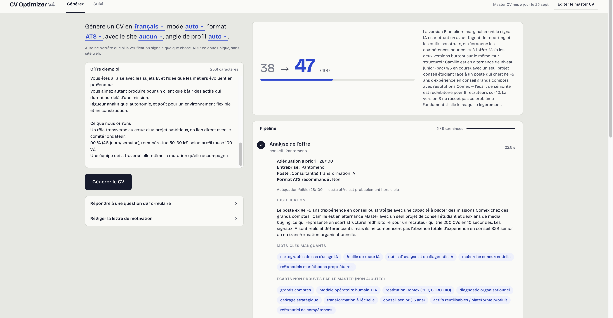

# cv-optimizer

Tailoring a CV to a job offer with an LLM is easy. Doing it without the model inventing skills or experience is the real problem.


*(interface in French)*

This tool generates a tailored one-page CV from a single source of truth (master-cv.json), and checks every line against it before export.

## What it does
1. Analyzes the offer and scores the fit, listing only the missing keywords the master CV can actually back up
2. Selects the most relevant experiences and projects from the master CV
3. Fact-checks the output: numbers and proper nouns by code, added claims by an LLM review
4. Scores the CV before and after tailoring
5. Exports a one-page PDF, designed or ATS-friendly, in French or English

## Why it's built this way
A CV that invents a skill is worse than no CV. So the master CV is the only source of truth: locked fields are never rewritten, internal notes are never printed, and translations are checked for overclaiming.

## Stack
Node.js · Express · Anthropic API · Puppeteer · built with Claude Code

## Run it locally
Requires Node.js 22.12 or later.

```bash
git clone https://github.com/idzouk/cv-optimizer.git
cd cv-optimizer
npm install
cp .env.example .env   # add your ANTHROPIC_API_KEY
npm start
```

Then open http://localhost:3000. master-cv.example.json is a fictional CV to try the tool with.
